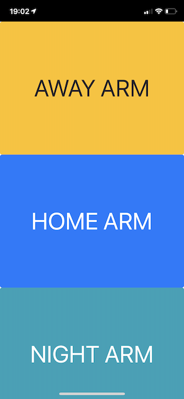
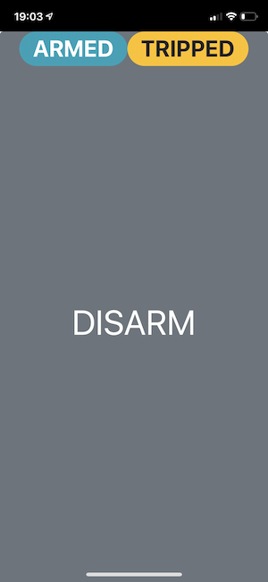

# homebridge-alarm-panel
> A [Homebridge](https://github.com/nfarina/homebridge) plugin providing an alarm system with a web UI.

**NOTE**: This is no longer actively developed as I have been required by my insurer to move to a "certified" solution (which costs a lot more and does the same thing).
 
### Aim

Provides a web UI alarm panel to view and manage a HomeKit based alarm system.

When used on a spare mobile device which has been positioned near an entrance door, it can act as a secure 
(fingerprint or passcode protected) alarm control panel.

The web UI provides:
 
* mode control:
    * *Disarm*
    * *Home Arm*   
    * *Night Arm*
    * *Away Arm*
* visual and optional audible(*) state indication:
    * *Arming*
    * *Home Armed*
    * *Night Armed*
    * *Away Armed*
    * *Tripped*
    * *Alarming*

State indication is also supported via optional webhook support (see Sonos Integration below).
 
You can use other HomeKit/Homebridge accessories and HomeKit automation to:

* set the tripped state when any door or window is opened (e.g. via an entry contact sensor accessory) if the alarm is armed.
* enable a siren or send an alert (e.g. via an SMS notification accessory such as 
[homebridge-twilio-sms](https://www.npmjs.com/package/homebridge-twilio-sms)) when in the alarming state. 

`*` A caveat with audible alerting is that the mobile device must stay awake if you wish the tripped and alarming
states to cause audible alerting on the web UI.

### Installation

1. Install Homebridge using: `npm install -g homebridge`
1. Install this plugin using: `npm install -g homebridge-alarm-panel`
1. Update your configuration file. See a sample `config.json` snippet below.

### Configuration

Example `config.json` entry:

```
"platforms": [
  {
    "platform": "AlarmPanel",
    "web_ui_port": "8888",
    "web_ui_poll_interval": 2,
    "web_ui_debug": false,
    "web_ui_arming_tone_mp3_url": "assets/audio/arming.mp3",
    "web_ui_tripped_tone_mp3_url": "assets/audio/tripped.mp3",
    "web_ui_alarming_tone_mp3_url": "assets/audio/alarming.mp3",
    "arming_tone_webhook_url": "http://127.0.0.1:5005/clipall/arming.mp3/50",
    "tripped_tone_webhook_url": "http://127.0.0.1:5005/clipall/tripped.mp3/50",
    "alarming_tone_webhook_url": "http://127.0.0.1:5005/clipall/alarming.mp3/50",
    "away_arm_delay": 30,
    "alarm_delay": 30,
    "arming_tone_interval": 3,
    "tripped_tone_interval": 2,
    "alarming_tone_interval": 1,
    "https_key_path": "/home/user/server.key",
    "https_cert_path": "/home/user/server.cert"
  }
]
```

Where:

* `web_ui_port` is the port that the HTML web UI and REST API are served from.
* `web_ui_poll_interval` is the interval in seconds between requests from the web UI to Homebridge to get the current state.
Defaults to 2 seconds.
* `web_ui_debug` if `true` logs out information on the web UI for debugging, defaults to `false`.
* `away_arm_delay` is the delay in seconds after the target *Away Arm*mode is set `on` before the corresponding target state is automatically set `on`. 
Defaults to 30 seconds.
* `alarm_delay` is the delay in seconds after the *Tripped* state is set `on` before the *Alarm Triggered* state is automatically set `on`. 
Defaults to 30 seconds.
* `web_ui_arming_tone_mp3_url` is a relative or absolute HTTP URL to an MP3 audio file to be used for the arming tone in the web UI. 
By default this has no value and is therefore disabled.
A usable MP3 is available at the internally hosted relative URL of `assets/audio/arming.mp3`
* `web_ui_tripped_tone_mp3_url` is a relative or absolute HTTP URL to an MP3 audio file to be used for the tripped tone in the web UI. 
By default this has no value and is therefore disabled.
A usable MP3 is available at the internally hosted relative URL of `assets/audio/tripped.mp3`
* `web_ui_alarming_tone_mp3_url` is a relative or absolute HTTP URL to an MP3 audio file to be used for the alarming tone in the web UI. 
By default this has no value and is therefore disabled.
A usable MP3 is available at the internally hosted relative URL of `assets/audio/alarming.mp3`
* `arming_tone_webhook_url` is an HTTP URL to request an arming clip playback via a webhook (see Sonos Integration below). 
By default this has no value and is therefore disabled.
* `tripped_tone_webhook_url` is an HTTP URL to request a tripped clip playback via a webhook (see Sonos Integration below).
By default this has no value and is therefore disabled.
* `alarming_tone_webhook_url` is an HTTP URL to request an alarming clip playback via a webhook (see Sonos Integration below). 
By default this has no value and is therefore disabled.
* `arming_tone_interval` is the interval in seconds between repeated playback of the arming tone in the web UI and/or via the webhook. 
Defaults to 3 seconds.
* `tripped_tone_interval` is the interval in seconds between repeated playback of the tripped tone in the web UI and/or via the webhook. 
Defaults to 1 seconds.
* `alarming_tone_interval` is the interval in seconds between repeated playback of the alarming tone in the web UI and/or via the webhook. 
Defaults to 1 seconds.

The web UI will be hosted on HTTPS if both `https_key_path` and `https_cert_path` are configured to point at HTTPS key 
and cert files available on the Homebridge server's local filesystem.

### Accessory Services and Integration

#### Security System

The accessory provides a standard HomeKit Security System service. The target state (*Disarmed*, *Home Arm*, *Night Arm*, *Away Arm*)
can be manually set from the Home app or the web UI. 

You can also use a HomeKit automation rule to set the target state to *Away Arm* when the last person leaves the house.

In the case of setting the target state to *Away Arm*, there will be a delay of `away_arm_delay` seconds before the current state
changes to *Away Armed*. In all other state changes the current state will update to the target state immediately.

A HomeKit automation rule should be configured to sound an alarm/send a notification etc. when the current state becomes
*Alarm Triggered* and to stop the alarm/send a notification when the current state becomes *Disarmed*.

A webhook (`alarming_tone_webhook_url`) is also provided for current state of *Alarm Triggered* (see Sonos Integration below).

#### Arming Sensor

The accessory provides a standard HomeKit contact sensor service called *Arming*. 

When the Security System's target state is set to *Away Arm* and before the current state changes to *Away Armed* (i.e. during
the `away_arm_delay` interval), the sensor will be set `on`. Once the `away_arm_delay` interval completes, the sensor will be set to `off`.

HomeKit automation can be configured to send a notification etc. when this is set `on`. 

A webhook (`arming_tone_webhook_url`) is also provided for this state (see Sonos Integration below).

#### Tripped Switch

The accessory provides a standard HomeKit switch service called *Tripped*. HomeKit automation should be configured to 
turn this `on` when entry is detected (e.g. via door/window contact accessories or movement sensors). 

Note that you can configure conditional rules so that *Tripped* is set `on` only for certain accessories based on the 
state of *Away Armed*, *Home Armed*, *Night Armed* (e.g. don't set tripped on upper level windows when armed for night.)

Note that the accessory logic ensures that setting *Tripped* to `on` only takes effect if the Security System 
current state is *Away Armed*, *Home Armed*, *Night Armed*. 

Note that the *Tripped* state can be set manually `on` (but not `off`) via the Home app,
however this is not the intended usage (apart from testing). 

When the *Tripped* state is set to `on`, after `alarm_delay` seconds, the current state of the Security System will be 
automatically set to *Alarm Triggered*. Once the *Alarm Triggered* state is set, the *Tripped* state will return to `off`.

HomeKit automation can be configured to send a notification etc. when *Tripped* is set `on`. 

While the *Tripped* state is `on` an audible alert will occur if `web_ui_tripped_tone_mp3_url`  or `tripped_tone_webhook_url` are configured.

#### Sonos Integration

The webhook support allows audible alerts on a Sonos speaker system via the [node-sonos-http-api](https://github.com/jishi/node-sonos-http-api) project. 

Download and install the latest version and then copy MP3 files for arming, tripped and alarming tones into the
 `static/clips` folder.
 
Once started, it should be possible to test the URLs to play these clips using `curl`:

    curl 'http://127.0.0.1:5005/reception/clip/alarming.mp3/80'

Once this is working, configure the following properties in the Homebridge `config.json` for the AlarmPanel platform:

* `arming_tone_webhook_url`
* `tripped_tone_webhook_url`
* `alarming_tone_webhook_url` 

### General Usage
 
Firstly, open the following URL in your mobile browser: [http://yourHomebridgeServerIp:web_ui_port](http://yourHomebridgeServerIp:web_ui_port)
and tap on the "Connect" button in the web UI (this is required to provide permission to the browser for programmatic control of the web audio playback).

In daily use of the web UI, tap on:

* the *Away Arm* button as you leave the house.
* the *Home Arm* or *Night Arm* button as you go upstairs/to sleep etc.
* the *Disarm* button as you enter the house/wakeup etc.

When the *Away Arm*/*Home Arm*/*Night Arm* button are tapped, the Security System target state will be set accordingly:

* If setting *Away Arm*, the *Arming* sensor will be set `on`. An audible alert will occur if `web_ui_arming_tone_mp3_url` or 
`arming_tone_webhook_url` are configured. After the `away_arm_delay` time, the Security System current state will be set accordingly 
and the *Arming* sensor will be set `off`.
* If setting *Home Arm*/*Night Arm* the Security System current state will be set accordingly immediately.

Whenever the *Tripped* switch is turned `on` while the Security System current state is *Away Arm*/*Home Arm*/*Night Arm* 
 an audible alert will occur if `web_ui_tripped_tone_mp3_url` 
or `tripped_tone_webhook_url` are configured. 

The *Tripped* state will remain on until:

* the Security System target state is set to *Disarm* on the Home App
* the *Disarm* button on the web UI is tapped, which causes the Security System target state to be set to *Disarm*
* the `alarm_delay` period expires causing the Security System current state to be set to *Alarm Triggered*.

If the Security System current state is set to *Alarm Triggered* an audible alert will occur if `web_ui_tripped_tone_mp3_url` 
or `tripped_tone_webhook_url` are configured.

The *Alarm Triggered* state will remain on until:

* the Security System target state is set to *Disarm* on the Home App
* the *Disarm* button on the web UI is tapped, which causes the Security System target state to be set to *Disarm*

NOTE: If Homebridge is restarted the state will be reset to *Disarmed*.





### HTTP REST API Details

NOTE: This section provides details of the internal design. Knowledge of this is not required to use the plugin.

The plugin provides a simple HTTP REST API which is used by the web UI.

The current state of the accessory can be queried by performing the following GET request:

`http://yourHomebridgeServerIp:web_ui_port/api/state`

This will return a response with content type `application/json` with the body content in the form:

    {
        "currentState": "<AWAY_ARMED|HOME_ARMED|NIGHT_ARMED|DISARMED|ALARM_TRIGGERED>",
        "targetState": "<AWAY_ARM|HOME_ARM|NIGHT_ARM|DISARM>",
        "arming": <true|false>,
        "tripped": <true|false>
    }

The state can be updated by performing the following POST request:

`http://yourHomebridgeServerIp:web_ui_port/api/state`

with the body content in the form (only the *away* switch state can be managed):

    {
        "targetState": "<AWAY_ARM|HOME_ARM|NIGHT_ARM|DISARM>"
    }
    
This will return a response with content type `application/json` with the body content in the form:

    {
        "currentState": "<AWAY_ARMED|HOME_ARMED|NIGHT_ARMED|DISARMED|ALARM_TRIGGERED>",
        "targetState": "<AWAY_ARM|HOME_ARM|NIGHT_ARM|DISARM>",
        "arming": <true|false>,
        "tripped": <true|false>
    }

The web UI specific config can be obtained by performing the following GET request:

`http://yourHomebridgeServerIp:web_ui_port/api/config`

This will return a response with content type `application/json` with the body content in the form:

    {   
        "web_ui_poll_interval": 2,
        "web_ui_debug": false,
        "web_ui_arming_tone_mp3_url": "assets/audio/buzz.mp3",
        "web_ui_tripped_tone_mp3_url": "assets/audio/buzz.mp3",
        "web_ui_alarming_tone_mp3_url": "assets/audio/beep.mp3",
        "arming_tone_interval": 3,
        "tripped_tone_interval": 1,
        "alarming_tone_interval": 1
    }

### Help etc.

If you have a query or problem, raise an issue in GitHub, or better yet submit a PR!

The web UI has ONLY been tested on an iPhone running Safari.
